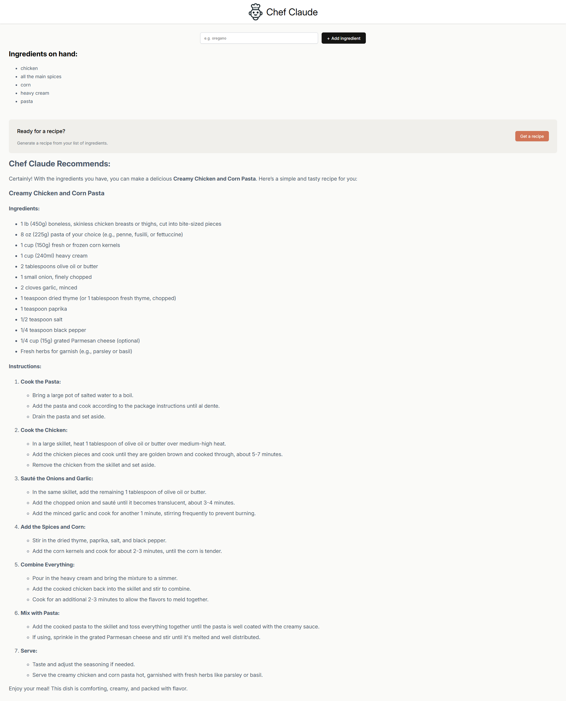
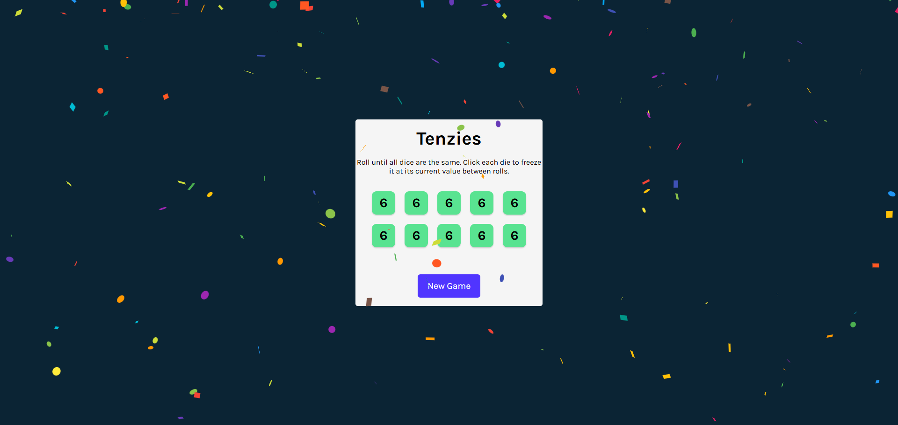
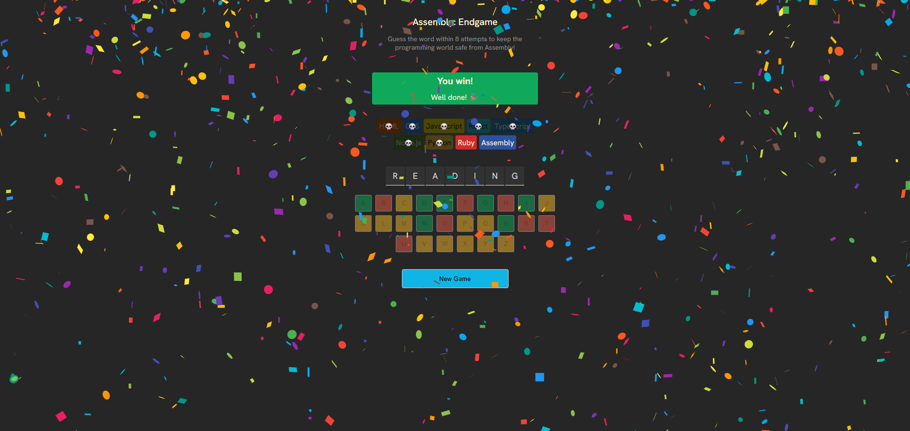
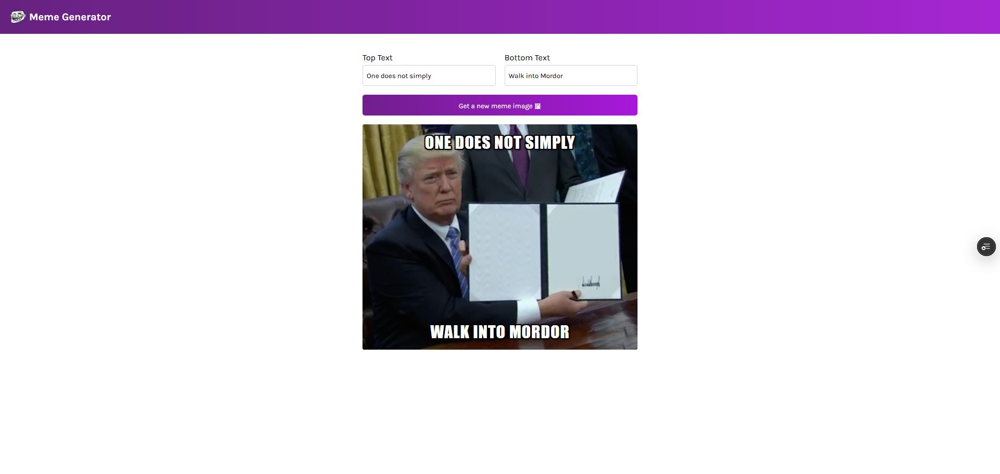
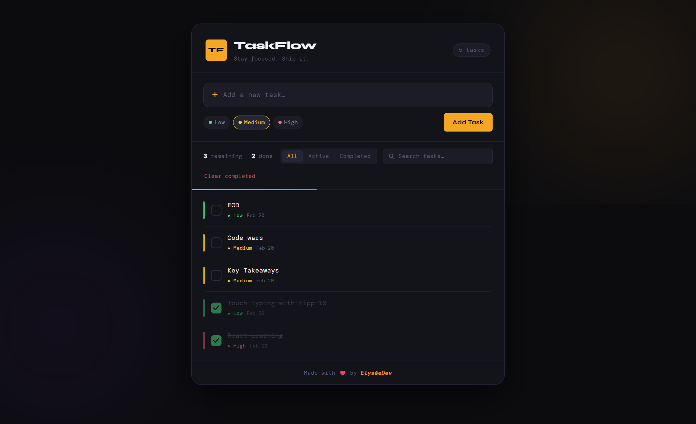

<div align="center">
    <h1 id="the-gym-react"><sup>🌐</sup><i>THE GYM REACT</i><sub>ᨒ</sub></h1>
    <p>A collection of React applications built during my React learning phase at The Gym Rwanda Software Engineering program. These projects demonstrate my understanding of React fundamentals, component-based architecture, and modern frontend development practices.</p>
</div>

---

<div align="center">

## ⚡ Tech Stack & Packages

### **Core Technologies**


### **UI & Effects**


### **AI & ML Integration**


</div>

---

## 📋 Worked On Projects

<div align="center">

### **Complete Projects**

|                                 Project Name                                  |                                                                          Preview                                                                           |
| :---------------------------------------------------------------------------: | :--------------------------------------------------------------------------------------------------------------------------------------------------------: |
|                            **🤖 [Chef Claude](#)**                            |                         <a href="#"><a/>                         |
|        **🎨 [Tenzies Game 🔗](https://tenzies-blush-rho.vercel.app)**         |      <a href="https://tenzies-blush-rho.vercel.app"><a />      |
| **📝 [Assembly Endgame 🔗](https://assembly-endgame-three-topaz.vercel.app)** | <a href="https://assembly-endgame-three-topaz.vercel.app"> <a /> |
|   **✨ [Meme Generator 🔗](https://meme-generator-eight-ochre.vercel.app)**   |    <a href="https://meme-generator-eight-ochre.vercel.app"><a />    |
|    **📋 [TaskFlow ToDo App 🔗](https://taskflow-todoapp-five.vercel.app)**    |         <a href="https://taskflow-todoapp-five.vercel.app/"><a />         |

</div>

---

## 🛠️ Installation & Usage

### Prerequisites

- Node.js (v18 or higher)
- npm or yarn

### Quick Start

```console
# Clone the repository
git clone https://github.com/elyse502/the_gym-react.git

# Navigate to project directory
cd the_gym-react

# Install dependencies
npm install

# Start development server
npm run dev
```

### Environment Setup

Create a `.env` file in the root directory of the [_Chef Claude project_](./chef-claude) and add the following environment variables:

```env
VITE_ANTHROPIC_API_KEY=your_anthropic_key
VITE_HF_ACCESS_TOKEN=your_huggingface_key
```

---

## 📦 Package Dependencies

```json
{
  "dependencies": {
    "react": "^19.1.1",
    "react-dom": "^19.1.1",
    "@anthropic-ai/sdk": "^0.12.0",
    "@huggingface/inference": "^2.6.0",
    "react-markdown": "^9.0.0",
    "react-confetti": "^6.1.0",
    "clsx": "^2.0.0",
    "nanoid": "^5.0.0",
    "axios": "^1.4.0",
    "react-hot-toast": "^2.4.0",
    "framer-motion": "^10.16.0",
    "chart.js": "^4.4.0",
    "react-chartjs-2": "^5.2.0"
  },
  "devDependencies": {
    "@vitejs/plugin-react": "^5.0.0",
    "vite": "^7.1.2",
    "tailwindcss": "^4.1.12",
    "@types/react": "^19.1.7",
    "@types/react-dom": "^19.1.7",
    "eslint": "^9.33.0"
  }
}
```

---

## 🎯 Learning Outcomes

Through these projects, I've mastered:

✅ React Hooks (useState, useEffect, useContext, useReducer)
✅ Component lifecycle and re-rendering optimization
✅ State management with Context API and Redux
✅ API integration and data fetching
✅ Responsive design with Tailwind CSS
✅ Form handling and validation
✅ Authentication patterns
✅ AI/ML API integration (Anthropic, Hugging Face)
✅ Modern build tools (Vite)
✅ Package management and dependency optimization

---

## 🔗 Live Demos

| Project           | Demo Link                                                    | Source Code                                                                                      |
| :---------------- | :----------------------------------------------------------- | :----------------------------------------------------------------------------------------------- |
| Chef Claude       | [Live Demo](#)                                               | [GitHub](https://github.com/elyse502/the_gym-react/tree/main/chef-claude)                        |
| Tenzies Game      | [Live Demo](https://tenzies-blush-rho.vercel.app)            | [GitHub](https://github.com/elyse502/the_gym-react/tree/main/capstone-projects/tenzies)          |
| Assembly Endgame  | [Live Demo](https://assembly-endgame-three-topaz.vercel.app) | [GitHub](https://github.com/elyse502/the_gym-react/tree/main/capstone-projects/assembly-endgame) |
| Meme Generator    | [Live Demo](https://meme-generator-eight-ochre.vercel.app)   | [GitHub](https://github.com/elyse502/the_gym-react/tree/main/meme-generator)                     |
| TaskFlow ToDo App | [Live Demo](https://taskflow-todoapp-five.vercel.app)        | [GitHub](https://github.com/elyse502/the_gym-react/tree/main/capstone-projects/todo-app)         |

---

## 📊 Project Statistics

<div align="center">

| Metric             |  Value  |
| :----------------- | :-----: |
| Total Projects     |   8+    |
| Components Created |   50+   |
| Lines of Code      | 10,000+ |
| APIs Integrated    |   5+    |
| AI Models Used     |    2    |
| Hours of Learning  |  100+   |

</div>

---

## 📚 What I Learned

### **React Fundamentals**

- Component-based architecture
- Props and state management
- Lifecycle methods and hooks
- Event handling

### **Advanced Concepts**

- Custom hooks creation
- Context API for global state
- Code splitting and lazy loading
- Performance optimization

### **Tooling & Ecosystem**

- Vite for fast development
- ESLint for code quality
- Prettier for code formatting
- Git for version control

### **AI Integration**

- Working with Anthropic Claude API
- Hugging Face inference models
- Streaming responses
- Prompt engineering

---

## 🤝 Contributing

Feel free to explore the projects and suggest improvements!

1. Fork the repository
2. Create your feature branch (`git checkout -b feature/AmazingFeature`)
3. Commit your changes (`git commit -m 'Add some AmazingFeature'`)
4. Push to the branch (`git push origin feature/AmazingFeature`)
5. Open a Pull Request

---

## 📄 License

This project is licensed under the MIT License - see the [LICENSE](https://github.com/elyse502/the_gym-react/blob/main/LICENSE) file for details.

---

## 🙏 Acknowledgments

- **The Gym Rwanda** - For providing this incredible learning opportunity
- **Instructors and Mentors** - For their guidance and support
- **Fellow Students** - For collaboration and feedback
- **Open Source Community** - For amazing tools and libraries

---

## 🚀 Support

For support, email _elyseniyibizi502@gmail.com_ or create an issue in the GitHub repository.

---

## 📞 Contact

For any questions or support, please contact:

- [**NIYIBIZI Elysée**](https://linktr.ee/niyibizi_elysee)👨🏿‍💻 | [Github](https://github.com/elyse502) | [Linkedin](https://www.linkedin.com/in/niyibizi-elys%C3%A9e/) | [Twitter](https://twitter.com/Niyibizi_Elyse).
- **Email**: <elyseniyibizi502@gmail.com>

[](https://www.linkedin.com/in/niyibizi-elys%C3%A9e/) [](https://twitter.com/Niyibizi_Elyse) [](https://github.com/elyse502)

---

<div align="center">

### ⭐ Star this repository if you find it helpful!

**[View All Projects](https://github.com/elyse502/the_gym-react)** • **[Report Bug](https://github.com/elyse502/the_gym-react/issues)** • **[Request Feature](https://github.com/elyse502/the_gym-react/issues)**

---

**Built with ❤️ during my React journey at [The Gym Rwanda](https://www.the-gym.rw)**

[⬆ Back to Top](#the-gym-react)

</div>
